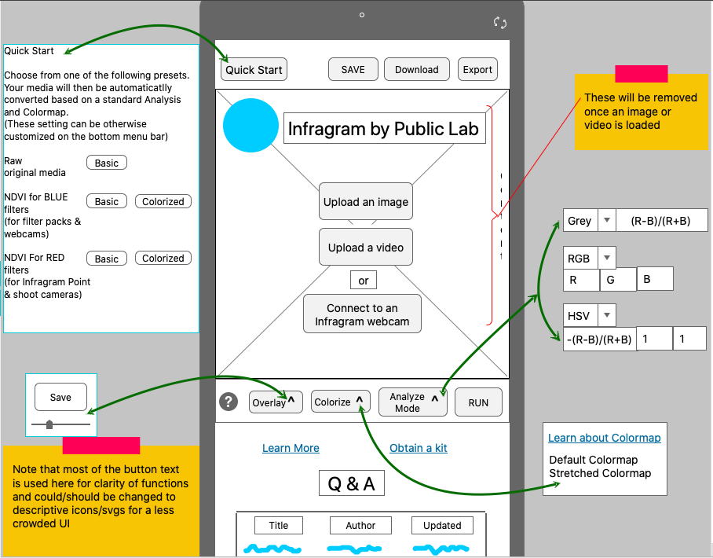
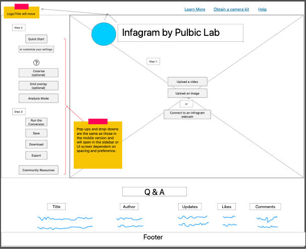

# Infragram Bootstrap Mock-up
The sole purpose of this code is to demonstrate how Bootstrap's powerful grid can be utilized for the re-design of the Infragram sandbox User Interface. It does not include titles, links or logos, but rather is meant to propose the Bootstrap grid layout that will allow for different mobile and desktop versions of the page. Please note **this is code is not a functioning representation of the Infragram processing tool and has included images along with minimal JavaScript code to  emulate how the code might appear in differing layouts.**

Bootstrap is full of incredible features that we are able to utilize to make our site exactly what we envision without the use of media queries. Here, I have employed the `order` property along with a multitude of `display` properties to effectively create a different full-screen layouts for the mobile and desktop versions of the image processor and it's toolbox of features.

As Bootstrap 4 is designed, it is required that some of the code be duplicated (with differing display properties) to achieve the layouts without media queries. Another option, which would not result in duplicate code (but would require the use of media queries), would be to utilize the powerful, two-dimentional CSS Grid property. I believe this could be used within a Bootstrap container, but only in Bootstrap 5 and not in version 4.

Please see the html file for specifics.

